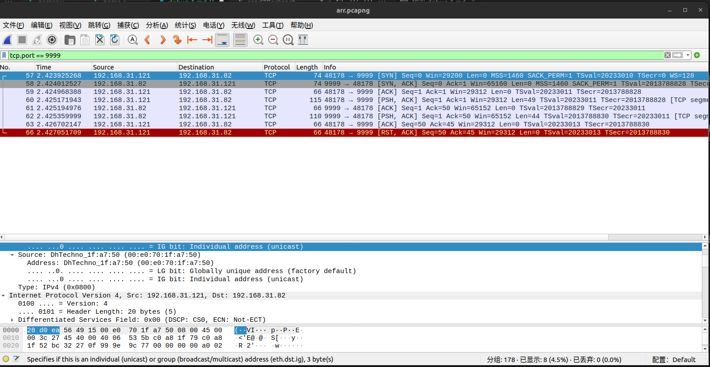

# TCP中，C的数组越界在python中的表现

## 1.异常表现
  C语言构建的socket服务端在C客户端下正常工作，但是在python客户端下频繁收到发生错误，recv函数总是返回-1，python客户端本身能够接受到消息。

## 2.异常分析
  使用linux errno 系统错误码，发现recv函数置错 104,客户端已经关闭。使用wireshark抓包分析（这里wireshark抓本机回环包貌似有些问题，在局域网的服务器上测试），发现客户端在消息传输结束时发送RST取代FIN。  
  搜索“TCP RST”相关内容检索得出：python在read未能读完缓冲区时关闭socket连接会导致底层调用发送RST包。  
  检查C服务端代码，发现send函数的指定数组越界，每次会多发4个字节。
## 3.原理推测
  C服务端发送了一个越界的字符串，在python客户端接收以后，提前读到了结束符并关闭客户端，但此时缓冲区的越界字符串内容没有被读取，导致关闭时python底层调用认为连接异常，发生RST包，此时python程序结束不再响应，C服务端检出RST，产生异常。

  附录（相关文章链接和附图）
  
<https://blog.csdn.net/u011068702/article/details/95385822>  
<https://www.cnblogs.com/myguaiguai/p/12069485.html>  
[recv返回值说明](https://blog.csdn.net/mercy_ps/article/details/82224128#:~:text=%E5%A6%82%E6%9E%9Crecv%E5%9C%A8copy%E6%97%B6%E5%87%BA%E9%94%99%EF%BC%8C%E9%82%A3%E4%B9%88%E5%AE%83%E8%BF%94%E5%9B%9E%20SOCKET_ERROR%20%EF%BC%9B%20%E5%A6%82%E6%9E%9Crecv%E5%87%BD%E6%95%B0%E5%9C%A8%20%E7%AD%89%E5%BE%85%E5%8D%8F%E8%AE%AE%E6%8E%A5%E6%94%B6%E6%95%B0%E6%8D%AE%E6%97%B6%E7%BD%91%E7%BB%9C%E4%B8%AD%E6%96%AD%20%E4%BA%86%EF%BC%8C%E9%82%A3%E4%B9%88%E5%AE%83%20%E8%BF%94%E5%9B%9E0%E3%80%82%20%E9%BB%98%E8%AE%A4,socket%20%E6%98%AF%E9%98%BB%E5%A1%9E%E7%9A%84%EF%BC%8C%E9%98%BB%E5%A1%9E%E4%B8%8E%E9%9D%9E%E9%98%BB%E5%A1%9Erecv%E8%BF%94%E5%9B%9E%E5%80%BC%E6%B2%A1%E6%9C%89%E5%8C%BA%E5%88%86%EF%BC%8C%E9%83%BD%E6%98%AF%20%3C0%20%E5%87%BA%E9%94%99%20%3D0%20%E8%BF%9E%E6%8E%A5%E5%85%B3%E9%97%AD%20%3E0%20%E6%8E%A5%E6%94%B6%E5%88%B0%E6%95%B0%E6%8D%AE%E5%A4%A7%E5%B0%8F%E3%80%82)  
<https://blog.csdn.net/u014779536/article/details/115839873>  
<https://blog.csdn.net/ol_m_lo/article/details/123991651>  
<https://blog.csdn.net/qq_41163331/article/details/90711482>  
<https://blog.csdn.net/guowenyan001/article/details/11766929>  
[重要分析来源-RST的几种情况](https://zhuanlan.zhihu.com/p/30791159)  
<https://read01.com/zh-tw/Ldy4kg.html>  
<https://blog.csdn.net/weixin_39715290/article/details/111226571>
<https://www.cnblogs.com/Jimmy1988/p/7485133.html>